import Tabs from '@theme/TabItem';
import TabsItem from '@theme/TabItem';

You have now completed a basic migration of a simple single VM workload or you have just setup Move 
and skipped straight here if you already know Move. Now that your comfortable with the basics of Move, 
let's explore a more advanced example.

In this section of the lab we will dive into some of the more advanced options available within the 
Move tool and how and when to utilize them. These types of scenarios are fairly common in larger and 
more security conscious environments. We hope they increase your and your organization's confidence in 
the Move tool and Nutanix to simplify the migration process.

You will be creating a second migration plan within the same Move instance you utilized in previous 
section. So jump back to the Move console and proceed with the following steps:

:::note
Before you proceed to create a second migration plan, please create an additional environment to add 
the assigned clusters you are in as the target for this lab, if you have not done so.
::: 

1. Click **Create a Migration Plan**.

:::note
If Create a Migration Plan button is greyed out, wait 2-3 minutes. Move must poll the source and 
target clusters and wait for their responses while 9 of your lab-mates are doing the same and 
migrating VMs!
:::

   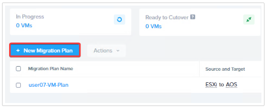

2. Enter a name for the Plan **User##-VM-Plan2**. Click **Proceed**.
   
   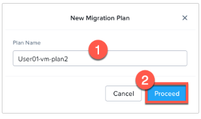

3. Select Source: ESXi and Target: Nutanix AHV. Click **Next**.

   - **Select a Source** : ESXi or whatever name you gave earlier
   - **Select a Target** : Nutanix AHV or whatever name you gave earlier
   - **Target Project** : None
   - **Target Cluster** : Select the destination AHV cluster
   - **Target Container** : default

   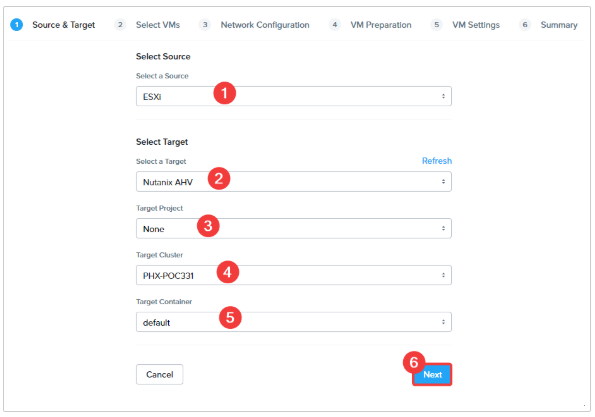

4. You are now presented with the list of VMs on the source cluster. A few things of note:

   - You will see that some VMs are unavailable to select. The plus button is shaded out.
   - They also have an icon to the right of them that explains which migration plan they are a part of.
   - When working at scale you will need to find the specific VMs that should be added to a plan. 
    This can be done manually, through filters, or by searching by name.

    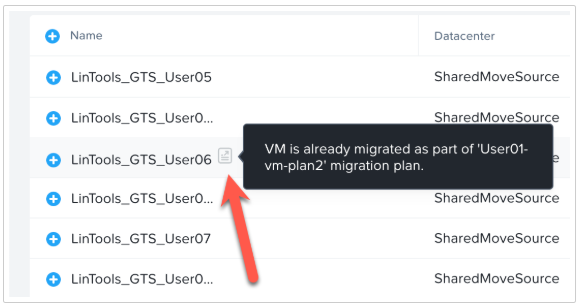 

5. We will use the Filter function to narrow down the VM that you will be migrating as part of this plan.

   - First click the Filters option on the left of the VM inventory.
   - Then expand the option for Tags.
   - Look for the tag named Local Backup and select it.

   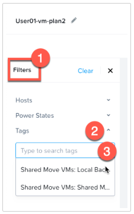

6. You should now see the VM inventory list is showing only the VMs on the ESXi source that have the 
selected vCenter Tag applied. This is helpful as it allows for easily finding VMs based on a tag that 
was applied by the organization for some purpose.

   - We can use this process to aide in the migration of Tags on the VMware side to Categories on the Prism 
    Central target.
   - Organizations use tags for many reasons. Some reasons are as simple as a way to find VMs that have a 
    specific purpose or belong to a group. Or, Tags could be the way that specific policies or rules are applied with a tool such as NSX.
   - If a matching or updated policy is created on the target side, we can then ensure the migrating workloads 
    will benefit from the same policies once they are migrated to the target.

   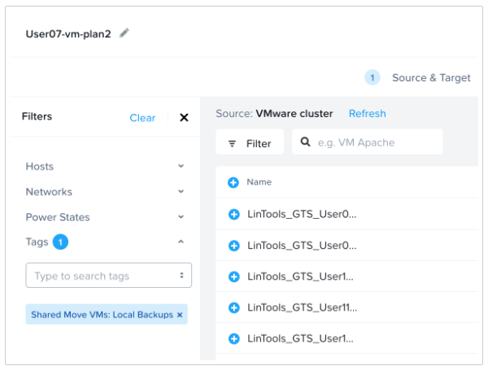

7. Select your Linux VM to Move, **XXX_User###_Tagged** where **XXX** is the preface provided to you 
by your instructor. You may need to hover over the VM to see the full name. Once selected, click 
**Next** in the bottom right-hand corner.

   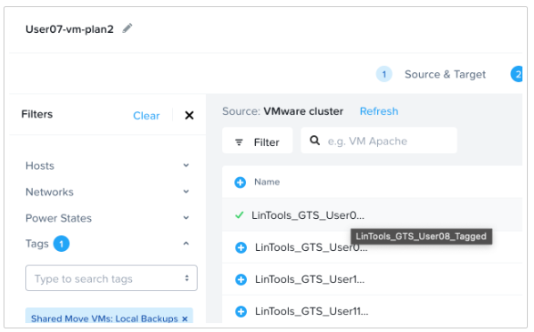

8. For Networks, Select **primary** for the Target Network and in Test Network select **secondary**. 
Click **Next**.

   - In the previous basic migration you selected a secondary network which is optonal.
   - In this migration you will see how to utilize this Test Network and how it can benefit organizations.

   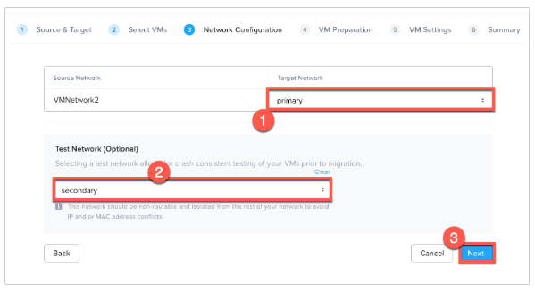

9. On the VM preparation page, in the previous migration example completed earlier you used the 
Automatic option to let Move execute all of the preparation steps for you. In this migration we will 
explain the Manual method and discuss some reasons to use it.

   - **Preparation Mode** - Manual. In Manual mode, by default Move will only migrate the data over.
     - The VM preparation script and all OS configuration options will have to be run outside of Move 
     either manually or via an automation step or 3rd party tool when in manual mode.
   - **Guest Operations**
     - Retain static IP Addresses from source VMs: If VMs have static IPs, they are retained on the 
     destination. If DHCP is used, like in our case, the VMs will get a new IP address on the destination.
     - Uninstall VMware Tools on target VMs: Since we are moving to AHV, we do not need VMWare Tools 
     installed on the VM.
     - Bypass guest operations on source VMs: Will only do data migration and no guest OS operations. 
     Keep this unchecked.

    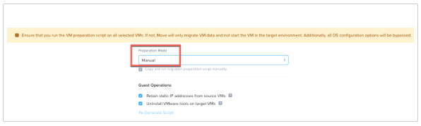

10. When using **Manual** preparation mode it provides the scripts for you to run outside of Move. 
We are going to have you copy these scripts, but won't make you use them.

   :::info
    There are a few reasons why one might need to use Manual preparation mode, but the most common is 
    privledges inside of the VM.

    - It is increasingly common that organizations will not widely give out elevated credentials to 
    access groups of VMs. For this reason the Automatic preparation mode in Move would not work.
    - But, if you can run these scripts with another method locally or remotely then the same Migration 
    experience can be accomplished.
    - Often organizations that have implemented tigther security practices will have a tool to remotely 
    execute scripts with unique credentials and this can likely be utilized.
    :::

    - There is a script to run for Windows VMs and one for Linux VMs. You should save the appropriate script(s)
    to a location that you can use them to run against the source VMs.
    - Click the **Copy** option for Linux VMs and the script will be copied to the clipboard.
    - Note: If you change the values above you will need to click the **Re-Generate Script** option to 
    adjust the scripts for the new changes.

      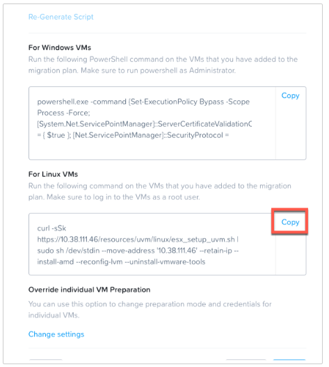

11. On your device, open the Notepad app and paste in the Linux script. You would then take this script 
and run it against any Linux OS VMs that are being migrated in manual preparation mode. Since you won't 
use this file later on, you can choose to ignore this step.

    - This can be done in many ways such as logging in with root privileges and running locally, accessing 
    the VM remotely and running the script, or by using a tool with elevated access to run the script remotely.
    - This will be a common step in secure environments and should not cause any concern.
    - You are copying and saving the manual preparation script - but you won't be using it in this lab.

    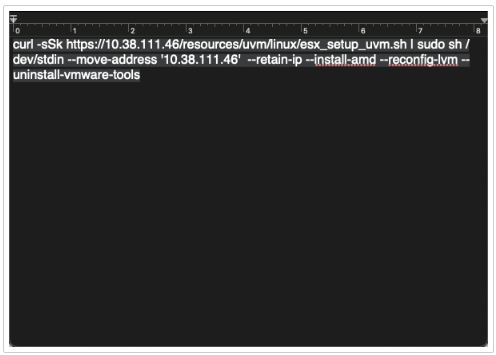

12. On the **VM Settings** page, keep the defaults for everything except the Category Settings which 
you will adjust in the next step.

    At the bottom the **Settings for Individual VMs**, allow for VM settings on this page to be 
    modified for specific VMs in the migration group like enabling Memory Overcommit as an example.

    :::note
    When enabling Memory Overcommit on VMs on AHV, they will initially utilize their full assigned 
    memory. Moving a large group of VMs with overcommit enabled can cause a surge of memory before 
    AHV sorts out how much memory the VMs use and the amount that can be shared. It's best to enable 
    Memory Overcommit in smaller groups or enable after the fact on small groups of VMs.
    :::
    
    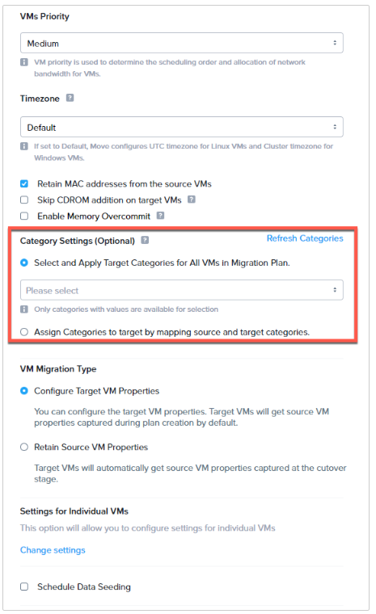

13. Now, move your focus to the **Category Settings** section of the page. The default selection of **Select 
and Apply Target Categories for All VMs in the plan** is an optional choice. If no category is assigned, 
it is skipped. If a PC category is assigned, it will be applied to every VM migrated as part of the group.

    - You will first select the **Assign Categories to target by mapping sourc and target categories** option.
    - This will allow us to map an existing tag on the VMware side to a Prism Central category on the 
    Nutanix side. Some of these should be familiar from the earlier lab setup!
    - Click the **Add Mapping** button to proceed.

    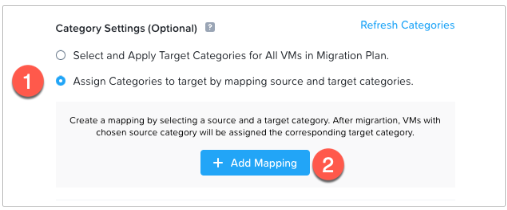

14. On the **Source Category** side click the box to open and you should see an existing tag for 
**Shared Move VMs: Local Backups**, select that and move to the next step.

    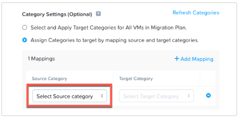

15. Now on the **Target Category** side drop down the list and type **Backup** in the search field. 
It will return an option for **AppFamily: Backup** select this category. This category will map your 
VM into a Protection Policy that has automatically been created for you.
    
    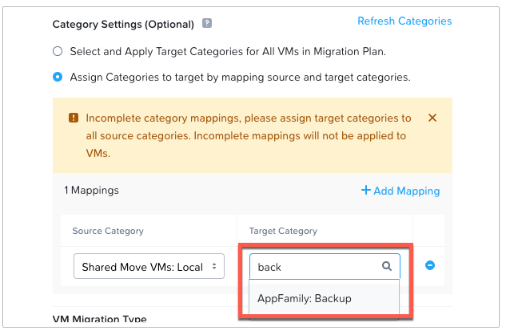

16. Click the **+Add Mapping** option and repeat the same steps on the category

    - Map the Source Category side to the existing tag for Shared Move VMs: Local Backups.
    - On the target side, search for a category with the following string User##:Production and 
    choose the one that corresponds to your student number. This maps to the Storage Policy created earlier.
    - Click **Next** to proceed.

    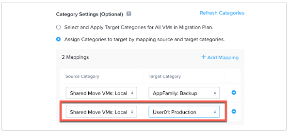

17. On the Summary page, click **Save and Start**. Selecting Save only saves the plan. Save and start 
will save the plan and start the Migration validation.

    - Note: If you get a migration error upon saving the plan, wait around 30 seconds and try 
    again.

    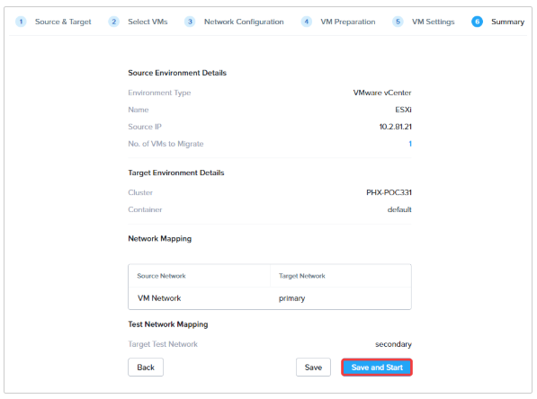
