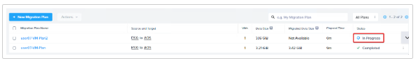
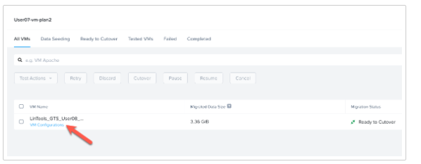
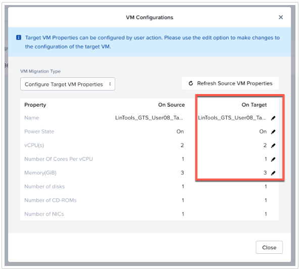
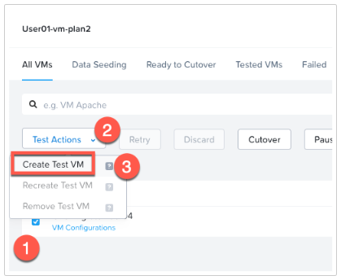
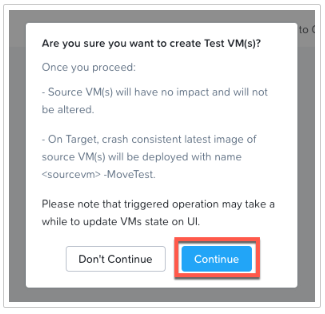
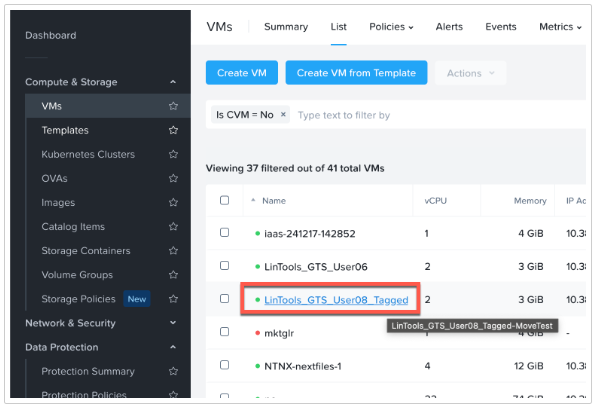
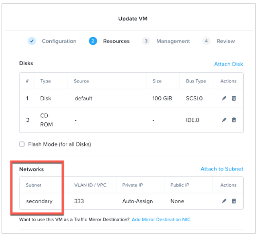
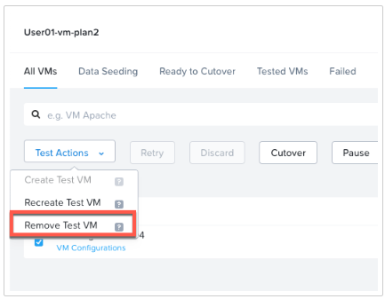
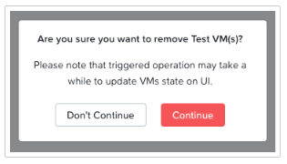
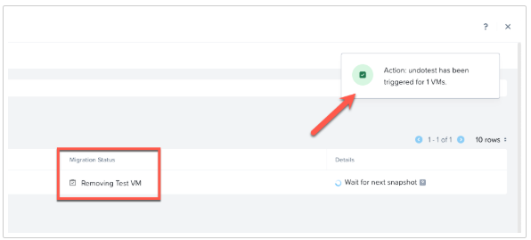

import Tabs from '@theme/TabItem';
import TabsItem from '@theme/TabItem';

You have now created your new advanced 
migration plan and will explore a few of the features that were configured in the previous steps.

1. In Move, locate your new plan and click on the Status section of **User##-vm-Plan2**

   

2. You are now looking at the details page of your advanced migration plan. You will notice the 
status will change from **Seeding Data** to **Ready for Cutover** depending on how fast you got to 
this page. The seeding goes fast as the single VM being migrated is very small. If several lab users 
are also creating plans and migrating VMs, this can take a few minutes due to queueing.

   - Did you know that you can adjust some of the settings of a VM being migrated before it is failed over? 
     Lets dig into that a bit and see what is possible. Click on the **VM Configurations** option shown 
     in the image below.

     
     
3. You are now looking at the VM Configurations screen for the VM you're migrating. You can modify 
these on a VM by VM basis. There are a handful of configurations items that can be modified. 
By default the target settings mirror the source settings for each VM. Explore them below then 
click **Close** or **Apply** and move to next step.

   - **Name** : Adjust VM name
   - **Power State** : Choose On/Off
   - **vCPU(s)** : Adjust number of CPU (sockets) assigned
   - **Cores per vCPU** : Adjust cores per vCPU
   - **Memory** : Adjust memory assigned to VM

   

4. You should now be back on the details view of your migration plan. Lets explore what is possible 
with the **Test VM** feature within Move. First select the VM in the plan with the checkbox, then 
click the drop down option for **Test Action** and click on the **Create Test VM** option. 
A few things of note:

   - This process will create a Test VM on the target cluster that is connected to the Isolated Test 
    Network that was configured when the plan was setup.
   - This network must be isolated to avoid any interuptions to the running production VM still 
    on the source cluster.
   - This will prevent an IP conflict, data being updated on test VM, and any other distruptive situations.
   - This test function is to ensure a VM or workload will migrate successfully before the actual migration. 
    This allows you to build confidence and allows for any issues to be corrected prior to the production 
    migration.

    

5. You should now see a pop-up window asking to confirm the creation of the Test VM. Go ahead and click 
**Continue** to proceed.

    

6. Next, switch back to your **Prism Central** instance to look for your newly created Test VM under 
**Infrastructure > Compute & Storage > VMs**. Look for your Test VM that should have the name of the VM being 
migrated with **-MoveTest** added to the end of the name.

    

7. Now that your Test VM is created and ready, you can select the VM within Prism Central.

8. From the **Actions** menu above, choose **Update VM** to look at the VM settings within Prism Central.

   - When the First page of the VM settings opens, click the **Next** button to advance.
   - On the **Resource** page of the VM you can view the network configuration and confirm the VM NIC is attached 
   to the **secondary** subnet.
   - Click **Cancel** and move to the next step.

   

9. Switch back to your Move instance to clean up the Test VM that was created.

   - Select the VM in your plan with the checkbox.
   - From the Test Actions drop down menu, choose **Remove Test VM** to start the clean up of the temporary test 
   VM.
     
     

10. You should be prompted with a pop-up to confirm the deletion of the Test VM. Click on the red **Continue** 
button to have Move clean up (delete) the VM.

    

11. You should now see that an Action was started to remove the Test VM, and the status of your Migration 
Place will show its removing the test VM.

   

12. You have now completed the exploration of some of the advanced options within a Move Migration Plan 
and can advance to the next section and Migrate the VM.