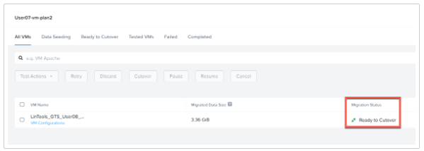
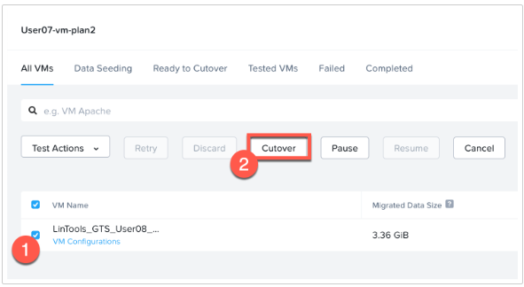
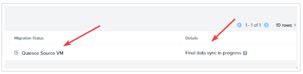
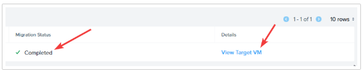
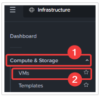
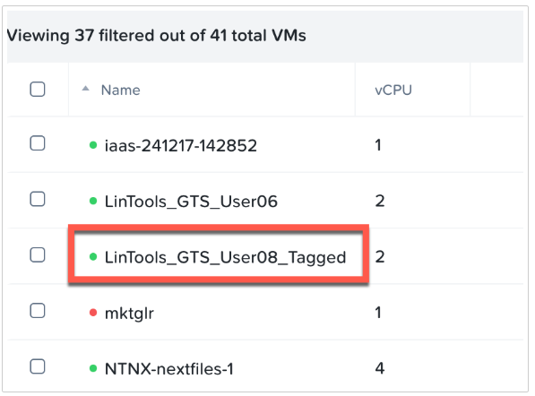
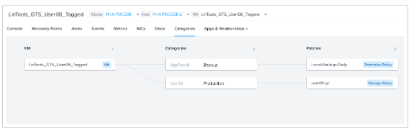

import Tabs from '@theme/TabItem';
import TabsItem from '@theme/TabItem';

You should move back to the console of your Move instance. We will now cutover the second plan 
and verify that our advanced settings are configured.

1. Find and click on your second migration plan created earlier. The status should show **Ready for 
Cutover** like the image below.

   

2. To perform the cutover, select the VM and Click **Cutover**. Click **Continue** to confirm.

   

3. You can monitor the cutover in status and details.

   

4. Once the cutover is complete, **Migration Status** will say **Completed** and **Details** will provide a 
link to View Target VM.

   **DO NOT CLICK ON View Target VM**. This will take you to Prism Element, but we will log back into Prism 
   Central.

   

5. Login to Prism Central

   - **username** - PC login adminuser##@ntnxlab.local or adminuser##
   - **password** - PC password from Connection Details

6. Navigate to **Infrastructure** > **Compute & Storage** > **VMs**

   

7. Look for your migrated VM in the main page or search in the search bar. Click on the VM name 
to open its summary page.
   
   

8. Once on the **Summary** page for the VM, click on the **Categories** option at the top of the summary page. 
This will confirm that the VMware tag was migrated over to the assigned Prism Central Categories and in 
turn the associated policies assigned to this VM as planned.

   - Looking at the box on the left represents the VM name that was migrated and your looking at the details for.
   - The middle box shows the categories assigned to this VM. In this case the **AppFamily: Backup** and 
   **User##**: **Production** categories that were mapped when the VM was migrated.
   - The box on right shows any policies assigned to this VM based on the categories assigned to it. This one 
    has a backup policy and a storage policy assigned to it. This places the VM automatically into the 
    Local-Backup-Daily Protection Policy and the user-**##**-sp Storage Policy.

    

CONGRATULATIONS!! You just completed a migration of your VM using several of the advanced features with 
Nutanix Move from ESXi to AHV. 

Next, let's explore using Move to migrate at scale.