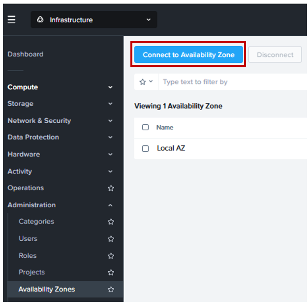

import Tabs from '@theme/TabItem';
import TabsItem from '@theme/TabItem';

Prior to any DR setup, you will need to prepare the clusters:

- To enable Disaster Recovery
- Connecting both source and target clusters in a new Availability Zone.

:::note
The following steps have already been performed by the instructor, as enabling Disaster 
Recovery and configuring the Availability Zone are one-time operations per Prism Central instance.
:::

## Enable Disaster Recovery

1.  Login to source Prism Central.

2.  At the bottom of the left panel, click on **Prism Central Settings**. A blade on the left will display
    the settings.

    

3. Under **Settings**, look for **Setup** and **Enable Disaster Recovery**. Click on it.

    

4. Ensure the **Prechecks successfully** has a green tick beside it and on the **Enable** button,
   click twice to turn on Nutanix Disaster Recovery. Give it a minute or two to enable the feature.
    
    

5. You should now see that **Nutanix Disaster Recovery enabled** on the same screen.

    

6. Now repeat **steps 1-4** to turn on Nutanix Disaster Recovery in the target cluster.

## Create New Availability Zone

1. Login to source Prism Central.

2. On the dashboard on the left, turn on **Administration** drop-down menu.
   
   
   

3. Click on **Availability Zones**.

4. Click on **Connect to Availability Zone**.

    

5. At Select Type, select **Physical Location**.

    

6. To connect to your target cluster, input the Prism Central credentials as shown below. Click **Connect**
   to proceed.

   

7. At the top banner, you should also see a notification that shows connecitivy to be successfully.

   

8. Give it a minute or two and once the connection is established, you should see the target Prism Central 
connection as below.

   

8. That's conclude the setup.

:::note
Should you have a three way DR scenario, you can add more Prism Central connections 
with the same steps as shown above.
:::

   

