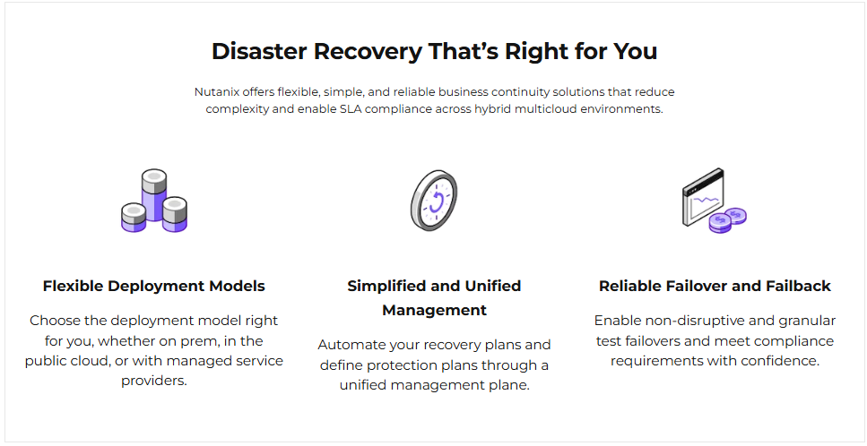

import Tabs from '@theme/TabItem';
import TabsItem from '@theme/TabItem';

Nutanix Disaster Recovery (DR) is a comprehensive solution designed to protect and recover critical workloads and data in the event of a disaster. It is part of the Nutanix Enterprise Cloud platform, which integrates compute, storage, and networking into a single, scalable solution. Nutanix DR leverages the platform's inherent capabilities to provide efficient, reliable, and cost-effective disaster recovery.

## Environment Information

- In this lab, you will using your assigned on-prem cluster and NC2 on AWS clusters to perform the disaster
recovery. There will be assigned VMs found in your clusters in the form of:
  - User01-MYSQL...User01-WebServer
  - User02-MYSQL...User02-WebServer
  - User03-MYSQL...User03-WebServer

- The instructor should assign a User number to each participant. The lab guide will reference entity 
names with **User##**, which should be substituted for their specific number (ex., User01).

:::info
You should refer to the Cluster Lookup Sheet if you are unsure of which clusters you are assigned to.
:::

