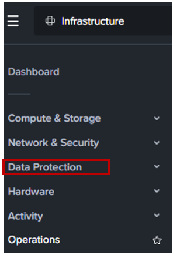
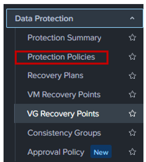
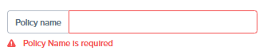
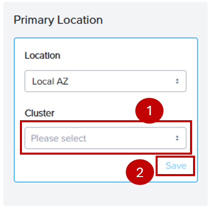
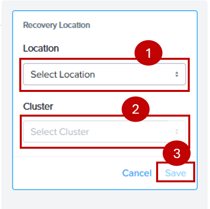
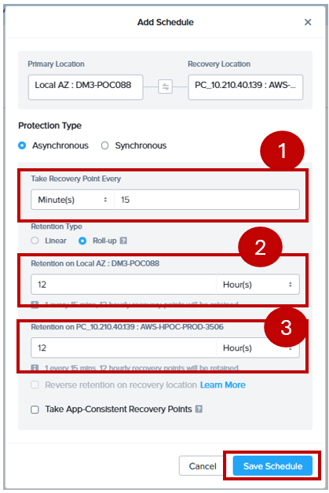
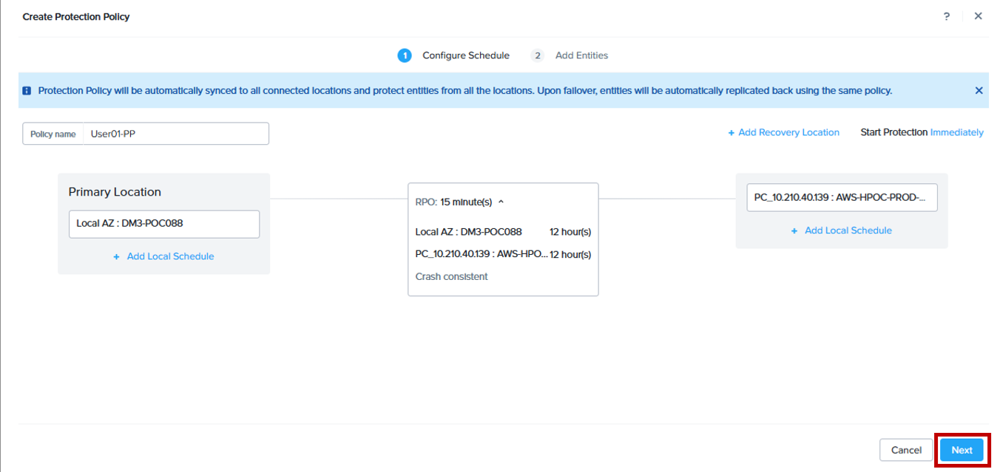
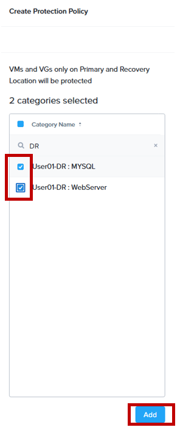
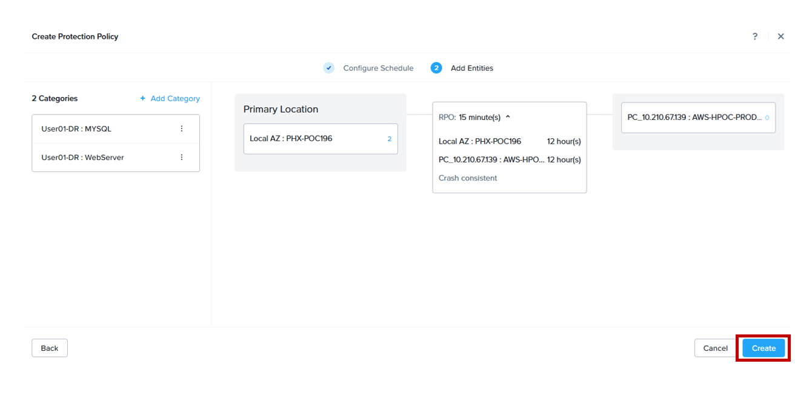
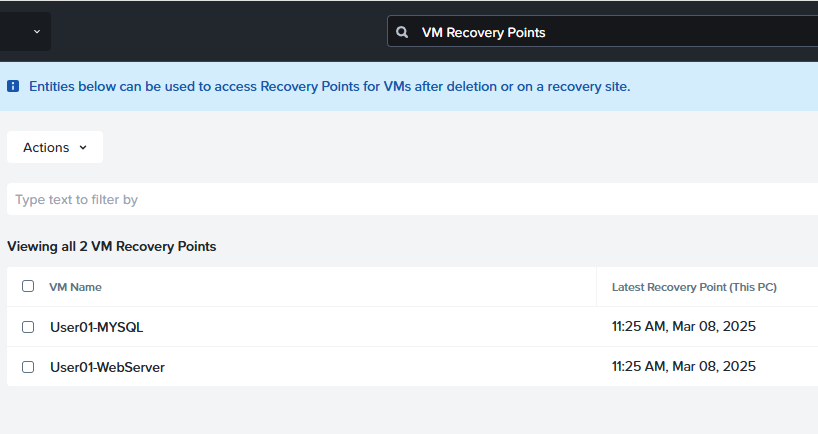

import Tabs from '@theme/TabItem';
import TabsItem from '@theme/TabItem';

## Creating Protection Policies

1. On the left panel, ensure your app switcher is turned to **Infrastructure**.
 
   

2. Click **Data Protection**.

   

3. Click **Create Protection Policy**
   
   

4. Name your policy such as **UserXX-PP** where XX is the assigned user number in the Cluster Lookup
   Sheet. 

   

5. Under **Primary Location**.
   - **Location**: Local AZ
   - **Cluster**: select the assigned cluster
   - Click **Save**

   

6. Under **Recovery Location**.
   - **Location**: select the assigned AWS cluster
   - **Cluster**: select the **NC2 cluster**
   - Click **Save**.

   

7. Click **+ Add Schedule** and fill in the following retention and schedule.
   - **Protection Type**: leave it as Asynchronous
   - **Take Recovery Point Every**: 15 mins
   - **Retention on Local AZ**: 12 hours
   - **Retention on** recovery site: 12 hours
   - Click **Save Schedule**.
   
   

8. Click **Next** to proceed.

   

9. In the category section. Filter with the **DR** keyword, search your pre-created categories.
   Check the tickboxes besides the VMs and Click **Add**
   
   

10. Click **Create**.

   

11. Head to the Prism Central Console in the NC2 cluster, and look at the **Protection Policies** tab.
    You will notice an identical policy created there. 

    :::info
    You might have to wait for up to 7-10 mins for the first recovery point to be created.
    In the meantime it's best for a coffee break 
    
    :::

12. Once you see the VM Recovery Points being created, you can start creating recovery policies.

    

   

