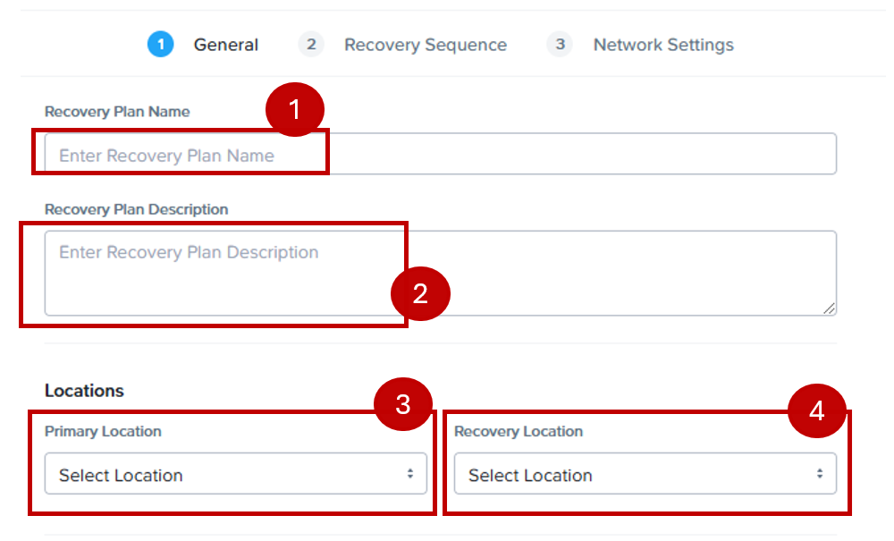

import Tabs from '@theme/TabItem';
import TabsItem from '@theme/TabItem';

## Creating Recovery Policies

1. Login to your assigned on-prem cluster.

2. Under **Data Protection**, click ***Recovery Plans**.

   

3. Click **Create New Recovery Plan**

   

4. Input the following information:

   - **Recovery Plan Name**: **UserXX-RP** where **XX** is your assigned user number
   - **Recovery Plan Description**: give it a meaningful description
   - **Primary Location**: Local AZ (on-prem cluster)
   - **Recovery Location** Nc2 cluster
   - Click **Next**. (bottom right of the screen)

   

5. Click **+VM(s)**.

   

6. Do the following:
   - **VM Name**: type in your User-XX vm names
   - Cick on the checkbox to select all your VMs
   - Click **Add** to proceed.

   

7. Ensure you check all the boxes next to your VMs. 
   Click **Next** at the bottom right side of your screen.

   

8. Select the following options:
   - **Network Type**: Non-Stretched networks
   - **Local AZ(Primary)**: **primary** for both production and test failback virtual network.
   - **Recovery**: **User VM Network** for both production and test failover virtual network.
   - Click ** Create** at the bottom right side of the screen.

   

9. Login to NC2 Prism Central and you shall see the identical Recovery Plan. 

10. Congratulations! You have successfully created a recovery plan!

11. Let's proceed to the next section to test those plans!

   

   