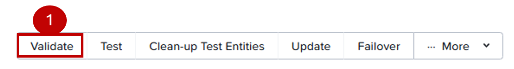
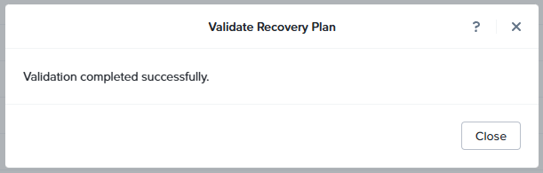
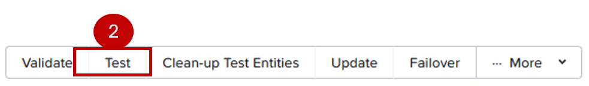
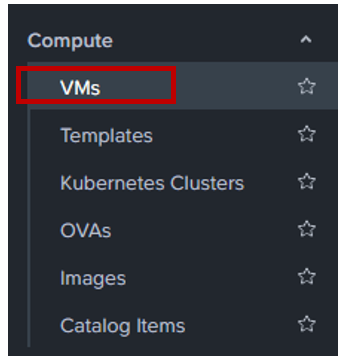
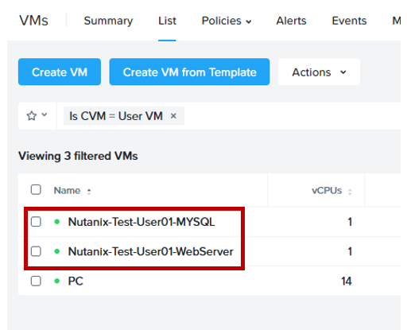
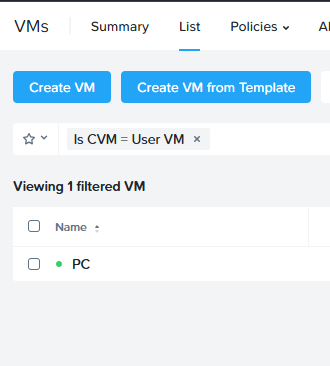
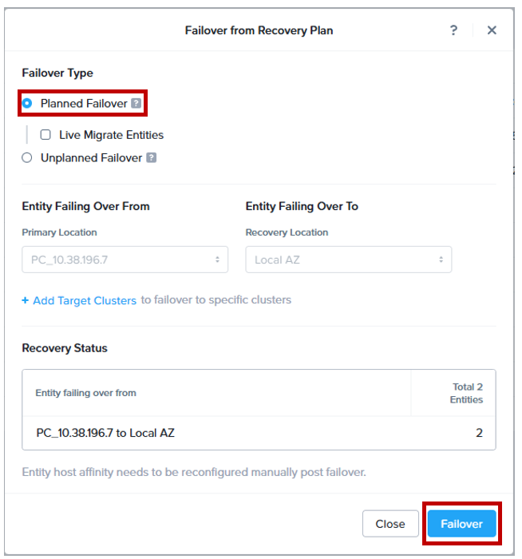
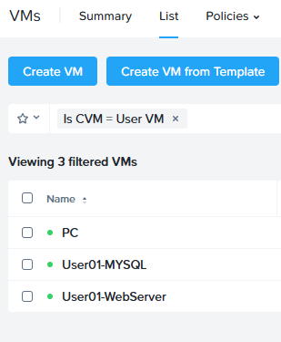
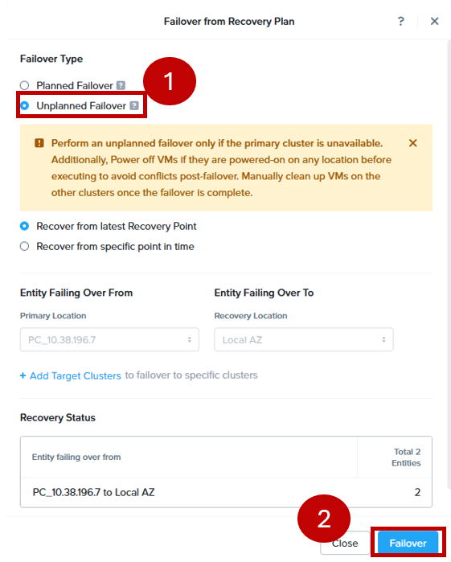

import Tabs from '@theme/TabItem';
import TabsItem from '@theme/TabItem';

## Testing your Recovery Plan

Now that the protection policies and the recovery plans are successfully confirmed.
We will take those test plans to work.

:::info
The following tests are simulating site failures occuring in on-premises clusters. 
:::

1. Login to Prism Central.

2. On the **Infrastructure** app switcher, go to **Data Protection** > **Recovery Plans**

3. Nutanix Disaster Recovery features a set of tools to simulate a DR scenario without necessarily disrupting
a production workflow. You will notice a set of options at the top right side of the screen.

   

   - Click on **Validate**.
   - **Click Proceed**.
   - Click **Validate** (At this stage, there will be a validation of various setups such as software 
   licensig, networking setup and etc)

   

   - Click **Close** once the validation is completed as above.You should also see the Status shown 
   **Succeeded** the the **Execution Reports**.

4. Next, Click on **Test** button.

   
   
   - Click **Test**. At this stage, there will be test VM entities being created from the recovery points
   that was setup in protection plans. Thesed test VM entities simulate an actual failover when is there a site
   failure in the Primary site.

   - At the same time you should see under the Status bar **Succeeded**.

5. Exit Recovery Plan window annd to **Compute** > **VMs**

   

6. On the right side of your screen, you should see the test VM entities, do a search on your **User##**
if you do not see it.

   

7. Go to **Data Protection** > **Recovery Plans**. Click on your recovery plan. We are going to clean up
the test entities. Click on  **Clean-up Test Entities**.
   
   
   

8. Go to **Compute** > **VMs** and you should see the test VM entities being cleaned up.

   

## FailOver Testing

Now we will perform an actual failover and failback operation.

:::info
You can login in simutaneously to both Prism Centrals to observe the behaviour.
:::

1. Login to NC2 Prism Central.

2. **Data Protection** > **Recovery Plans**.

3. Go to your recovery plan and click on **Failover**

   
   
4. Select **Planned Failover** and click on **Failover**.

   

5. Type **Failover**. Click **Failover**.

   

6. Under **Compute** > **VM**. Observe the machines as they failover.

7. In under 30 seconds depending on how many are triggering the same exercise as you. You should 
see a successful failover.

   

8. Login to on-prem Prism Central and you will observe that your **UserXX-MYSQL** and **UserXX-WebServers** 
are longer in the clusters.

## Failback 

:::note
To perfom a failback process, you need to login to on-prem cluster Prism Central.
:::

1. Login to On-prem cluster Prism Central.

2. Repeat **steps 1-8** in the Failover instructions to perform the failback recovery.

3. In the meanwhile stay on **Compute** > **VM** properties page to observe the failover process!

4. Congratulations!! You have finally complete the labs!!

## Failover - Unplanned

:::info
Due to time constraints, I have intentionally leave this as an optional lab.
You can try to attempt the lab through an Unplanned Failover.
:::

1. Repeat **steps 1-8** in **FailOver** section.

2. Select **Unplanned Failover** and **Recover from latest Recovery Point**

   

  
   
   