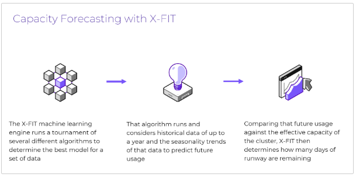

import Tabs from '@theme/TabItem';
import TabsItem from '@theme/TabItem';

## Capacity Planning

### Overview

In this section, you will learn how to use the Capacity Forecast and Planning feature to get hardware 
recommendations to extend the capacity runway and plan for future workloads.

Nutanix Cloud Manager comes with built-in machine learning (called X-Fit and pronounced cross fit) that 
is constantly analyzing and learning how the running workloads consume compute and storage capacity. T
his machine learning provides actionable signals that the admin can then take action on. One of the signals 
it provides is the “cluster runway” number, which will forecast how well the existing capacity will meet 
the demands of the business, based on predicted growth rates that are calculated from past growth patterns.

This same engine also enables admins to plan for future expansion, by allowing users to create planning 
scenarios based on their needs. In both cases (to meet existing runway needs or to plan for future 
workloads), Nutanix Cloud Manager provides a simple-to-use, yet powerful tool that will provide hardware 
recommendations to meet the business needs.

## Walkthrough Demo

Here is the link to the guided walkthrough to demonstrate the feature in action. 
https://nutanix.storylane.io/share/scmtpldnvhqi
When you've completed this guided walk-through, come back to the lab manual.
