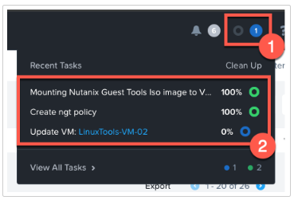
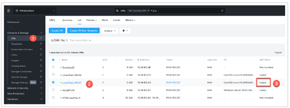

import Tabs from '@theme/TabItem';
import TabsItem from '@theme/TabItem';

     ## Overview

NGT is short for Nutanix Guest Tools and is made up of several pieces. You can use any combination 
of these NGT pieces with the device drivers being the most important one.

- Device Drivers
- VSS Driver (Volume Shadow Copy Service)
- Self Service Backup

NGT also reports back details to Prism such as which operating system is running and other information.

At a minimum, the device drivers portion of NGT must be installed before migrating a VM to AHV, or 
during new VM OS install. Other NGT functions can be enabled or disabled at any time.

:::note
You will be installing NGT into the Linux VM migrated from ESXi to your AHV cluster earlier. Move only 
installed the device drivers and not the full NGT package.
:::

### Installing NGT from Prism Central

You will now install NGT in your migrated VM.

You should be logged into your Prism Central instance to proceed with the following steps.

1. Click on navigation to expand the menu. Click on **Compute & Storage** to expand. Select **VMs** to see 
the list of VMs available on the PC instance.

   

2. Find your VM named **XXX-User##** where **XXX** is the preface provided to you by your instructor and select 
it by checking the box to the left.

   

3. Next, click on the **Actions** drop-down menu above, scroll down the menu, and click on **Install NGT**.

   

4. An Install NGT window will open. Select the checkboxes to enable both SSR & VSS. Next, check the 
radio box to **Restart as soon as the install is completed**.

   

5. Click **Confirm & Enter Password** to proceed.

6. Next, provide local credentials to the guest OS so the NGT install process can proceed. Enter the 
credentials below and click **Done**.

   - Username: **rocky**
   - Password: **nutanix/4u**

   

7. The process to start installing NGT in your VM has begun. If you would like to monitor the progress, 
you can click on the recent tasks icon on the top menu of Prism Central to watch the status. You will 
notice three tasks were created for this process.

   

8. If there are too many tasks starting because of the number of participants in the boot camp, you can 
click on the **View All Tasks** option at the bottom of the tasks window. This will take you to the log of 
all tasks of the cluster and you can locate and monitor the tasks for your VM name.

   

9. Once all the tasks for your VM have finished, you can navigate back to the VM list and find your VM.

10. Find your VM in the list and look at the **NGT Status** column. It should now show that NGT is installed 
with the latest version or recommend an upgrade if available.

    
