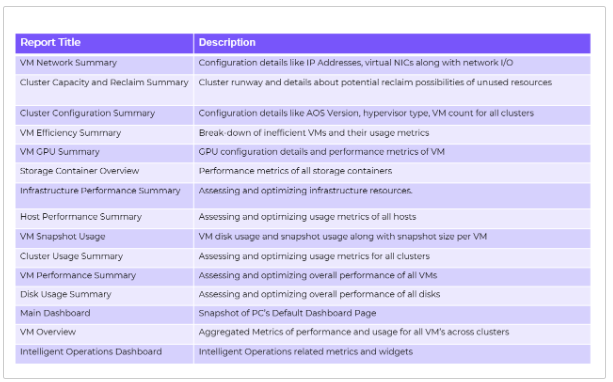
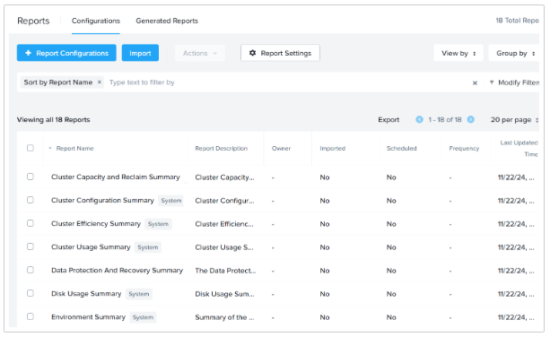
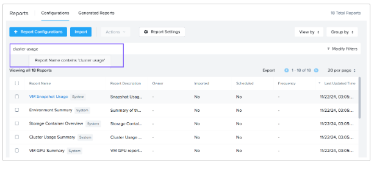
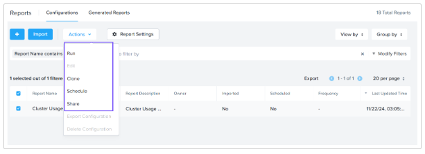
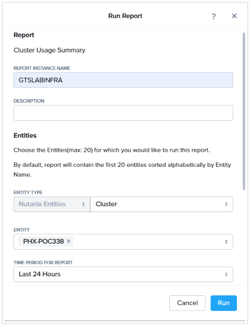

import Tabs from '@theme/TabItem';
import TabsItem from '@theme/TabItem';

## Overview

The report management feature enables 
you to configure and deliver historical reports containing detailed information about infrastructure 
resources across Nutanix-managed and non-Nutanix-managed environments. This tool provides valuable 
operational insights directly to your mailbox based on the schedule you define.

### Key Capabilities

- PDF and CSV Report Generation
- Report Scheduling
- 18 Predefined Out-of-the-Box Reports
- Import and Export Reporting Configuration across PCs

## Create a Report

An IT Administrator seeks data about their production infrastructure in the last 6 months to gain insights 
into its utilization efficiency. Let’s explore how reports can be utilized to address this scenario.

1. Login to Prism Central using adminuser## and the PC password from the Connection Details page.

2. Navigate to the App Switcher section in the top left of Prism Central. Click Intelligent Operations 
in the App Switcher.

3. Select Reports from the Intelligent Operations Dashboard.

4. We can view the list of pre-defined system reports as well as custom reports.

   

5. We will look for Cluster Usage report based on our use case. Enter **Cluster Usage** in the filter by field.

   

6. Select the **Cluster Usage Summary** and click **Actions**.

   

7. This report is pre-defined system Report. A System report, can be run, scheduled, shared and cloned to 
make changes. Now, Let's select **Run**.

8. Provide a name in the **Report Instance Name** field.

9. Choose the cluster in the **Entity** field.

10. Choose **Last 24 Hours** in the Time Period for Report.

11. Select your Time Zone.

12. Choose **PDF** as the Report Format.

     

13. Click **Run**.

14. Click the **Generated Reports** to view the Report.

15. Click **PDF** next to the Cluster Usage Summary Report Name.

16. The Report is downloaded in PDF format.

17. Here is an example of what the report would look like.

