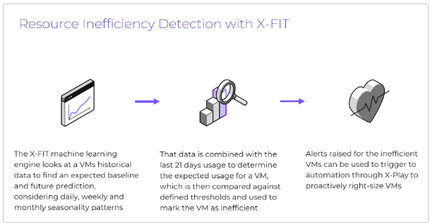

import Tabs from '@theme/TabItem';
import TabsItem from '@theme/TabItem';

In this section, you will learn about the Resource Inefficiency Detection feature and how to 
view inefficient VMs within the UI.

The X-Fit machine learning algorithm looks at a VM’s historical data to find an expected baseline and 
future prediction, taking into account seasonality patterns. The baseline and prediction data is combined 
with the last 21 days of usage to determine the expected usage for a VM, and will mark the VM as 
inefficient based on defined thresholds. For example, if a VM’s average memory usage over the past 
21 days was less than 20% for the majority of the time (>99.5% of the time), the VM will be marked 
as overprovisioned on memory.

In the previous section, we extended the runway by getting a hardware recommendation. Another way to 
extend the runway is to optimize the current workloads, by addressing the inefficiencies.

The 4 types of inefficiency are:

- Overprovisioned - a VM that is over-sized and wasting resources which are not needed
- Constrained - A VM that does not have enough resources for the demand and can lead to performance 
bottlenecks.
- Bully - a VM that consumes too many resources and causes other VMs to starve
- Inactive - a VM that has been powered off or has minimal I/O and network traffic

  

  ## Walkthrough

  Here is the link to the guided walkthrough to demonstrate the feature in action. 
  https://nutanix.storylane.io/share/1cyx8cigr5qk
  When you've completed the guided walk-through, come back to this lab guide.

  