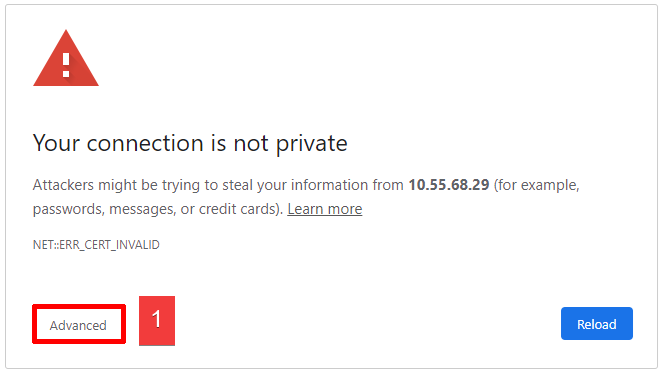
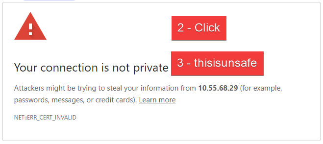
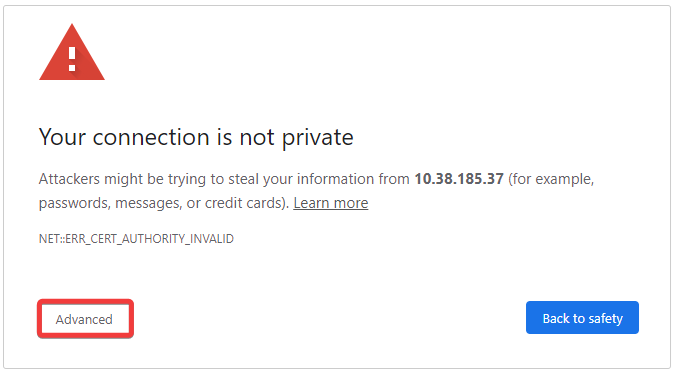
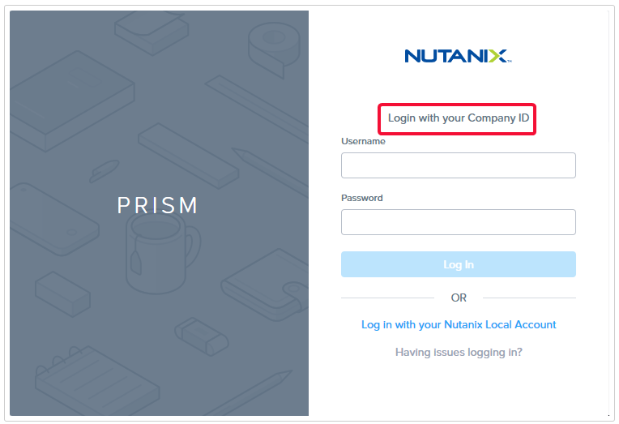
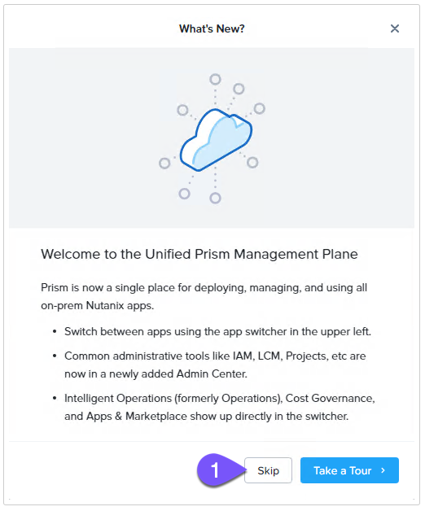

import Tabs from '@theme/TabItem';
import TabsItem from '@theme/TabItem';

# Environment Details

These bootcamps are intended to be run within the Nutanix Hosted POC (HPOC) environment.
Your cluster contains all the necessary images, network, and VMs to complete the exercises.

:::danger
Do not perform any upgrades to the environment, including but not limited to Prism Element (PE), Prism Central (PC), Acropolis Operating System (AOS), Nutanix Cluster Check (NCC), Foundation, any hardware-specific updates (ex. firmware), and any software within any remote sessions (ex. Graylog, Linux packages, PuTTY, Sublime Text).

Doing so will negatively impact your lab experience and potentially any other attendees using this cluster.
:::

# Remote Connection

1. Follow the instructions provided in the email as pre-work prior to the actual day.
2. Follow the instructions provided to get connected either via VPN or #Parallels remote    
   desktop using the pre-assigned login credentials against your name.
3. Use Google Chrome Incognito mode to connect to the VDI environment.
4. Be patiemt while connecting to the VDI session and note that resizing or changing the VDI 
   resolution will result in reconnection, so it is not recommended.

:::warning

Always use applications within the remote session. Otherwise, the version you use may look or operate differently, negatively impacting your ability to complete the lab in the allotted time. Additionally, this aids with handling downloaded files, as all files would be within the remote session.
:::

# Know Before You Go

- Never use the information within screenshots in your environment (ex., IP addresses.)  
  Screenshots are shown for illustration purposes only.

- Ignore any IP addresses that resemble 169.254.###.###.

- Throughout the lab, you will see the usage of ##. Replace the ## with your assigned
  number (ex., adminuser01).

  For example:

  - Active Directory user - adminuser01@ntnxlab.local
  - Move VM: User01-Move
  - Desktop VM: Desktop01

- If instructed to:
  - SSH (Secure Shell): Use PuTTY within your VDI desktop/session.
  - Remote Desktop, Remote Desktop Protocol (RDP), or Remote Desktop Connection (RDC): Remote 
    Desktop Connection via Start Menu > Remote Desktop Connection.

- If you are presented with a security warning in Chrome, use one of the following methods
  to proceed.
  - **Method 1**
    1. Click **Advanced**.
   
   
       
   
    
    2. Click on any blank section within the main browser window.
    
    3. Type "thisisunsafe" without the quotes. Note. The text you type will not be visible.
       
       
  
  - **Method 2**
  
    1. Click **Advanced**.
       
       
       
  
    2. Click **Proceed to IP-ADDRESS(unsafe)**.
       

# Connection to Prism Central (PC)

1. Make sure you are connected to your VDI

   :::note

     Use **CTRL + V** to paste between your computer and the VDI (dont use the command key in Mac)
   :::

2. Login to Prism Central by opening the Prism Central link from Connection Details.

3. Ensure the Login screen says **Login with your Company ID**.

4. Replace **##** with your User **#**. For example, if your User **#** is **01**, login as adminuser01.
   Note that your assigned cluster and the credentials will all map to your name.

   - username - PC username adminuser##@ntnxlab.local or adminuser##
   - password - PC password provided from Connection Details
     

5. Skip the tour.
   

  
 