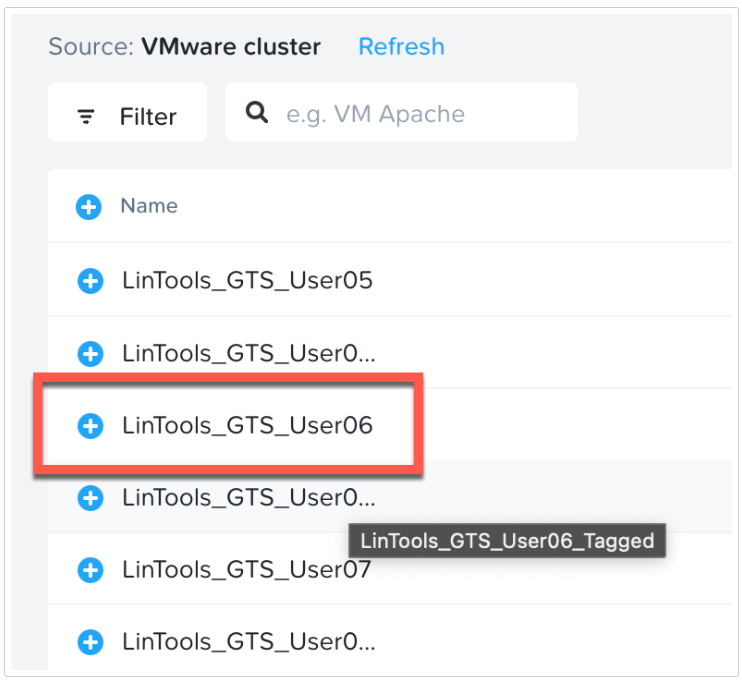
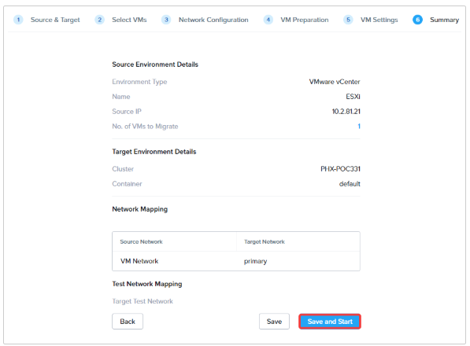

import Tabs from '@theme/TabItem';
import TabsItem from '@theme/TabItem';

Once the source and destination are set up, create the migration plan.

1. Click **Create a Migration Plan**

    :::note
    If **Create a Migration Plan** button is greyed out, wait 2-3 minutes.
    :::

   

2. Enter a name for the Plan **User##-VM-Plan**. Click **Proceed**.

   

3. Select Source which is ESXi and Target which is Nutanix AHV. Click Next

   - **Select a Source** : ESXi or whatever name you gave above
   - **Select a Target** : Nutanix AHV or whatever name you gave above
   - **Target Project** : None
   - **Target Cluster** : Select the destination AHV cluster
   - **Target Container** : default

   

4. Select your Linux VM to move, **XXX-ECV-User##** where **XXX** is the preface provided to you 
by your instructor. Once selected, click Next in the bottom right-hand corner.

   - There will be two VMs for each student with your student number on them. They have the same name, 
except that one has _Tagged added to the end of the name. **In this migration plan, be sure to use 
the one without tagged in the name.**
   - You may need to use the filter and hover over the VMs to see their full names.

     

   - You can safely ignore the yellow warning icon stating "The VM has a guest OS which 
   is not supported on ESXi", since we are migrating to AHV.

     

5. For Networks, Select **primary** for the Target Network. Click **Next**.

     

 6. On the VM preparation page, select the options shown and provide the username and password 
 for the Linux VM.

    - Preparation Mode - Automatic. Manual mode only migrates data over. VM preparation script and 
    all OS configuration options will have to be run manually in manual mode.
    - Guest Operations
      - Retain static IP Addresses from source VMs: If VMs have static IPs, they are retained on the 
      destination. If DHCP is used, like in our case, VMs will get a new IP address on the destination.
      - Uninstall VMware Tools on target VMs: Since we are moving to AHV, we do not need VMWare Tools 
      installed on the VM.
      - Bypass guest operations on source VMs: Will only do data migration and no guest OS operations. 
      Keep this unchecked.
      - Credentials
        - User Name: rocky
        - password: nutanix/4u

        

        :::note
        You only need to enter these credentials into the Linux VMs field and can leave the Windows 
        credentials empty.
        :::

7. On the VM Settings page, keep the defaults and select **Next**. The fields allow for individual VM 
settings to be modified. This includes settings like enabling Memory Overcommit or applying categories 
that are present in Prism Central.  

   

8. On the **Summary** page, Click **Save and Start**. Selecting **Save** only saves the plan. Save 
and start will save the plan and start the Migration.

:::note
If you get a migration error upon saving the plan, wait around 30 seconds and try again.
:::

   

