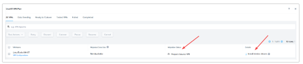
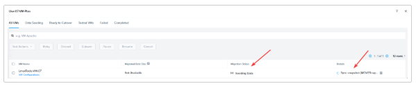

import Tabs from '@theme/TabItem';
import TabsItem from '@theme/TabItem';

Once the Migration plan is started, it will first validated against the environment.

1. Verify Plan Validation in the Status section

   

2. Once validation succeeds, the status changes to **In Progress**. Click **In Progress** to 
monitor the status.

   

3. You can monitor the **Migration Status** and **Details** on this page. This should take 
about 5-10 minutes. A perfect time to get a cup of ☕.
For curious minds, during this step, Move is preparing the source VM for transfer 
by doing tasks like installing Nutanix VirtIO drivers and doing data seeding on the target cluster.

   

   

4. Once the data seeding is complete, the status becomes **Ready To Cutover**. 
It also gives an estimate for cutover time so you can plan the actual cutover.

   

   If you are on the main page of Move, a blue dot means it is ready for cutover.

   

5. To perform the cutover, Select the VM and Click **Cutover**. Click **Continue** to confirm.

   

6. You can monitor the cutover in **Migration Status** and **Details**.

   

7. Once the cutover is complete, **Status** will say Completed and **Details** will provide a link 
to View Target VM.
   **DO NOT CLICK ON View Target VM**. This will take you to Prism Element but we will log back 
into Prism Central.

   

8. Login to Prism Central

   - **username** - PC login will be adminuser##@ntnxlab.local or adminuser##
   - **password** - PC password from Connection Details

9. Navigate to **Compute & Storage** > **VMs**

   

10. Look for your migrated VM in the main page or you can search in the search 
bar. Make a note of your VMs IP address.

    

11. You will be using the IP address of your migrated VM to connect to a code-server via the browser in the Parallels VDI environment.

    link - http://vmIP:8001

    

12. You will then be able to log into the code-server with the following:

    - password - Lookup Cluster Sheet
    

     :::note
     All users will use the password regardless of what 
     other passwords you've previously used.
     :::
     You will then be able to access the terminal.
    
    

13. In the console window, type the "ls" command and verify the file is present.

    

CONGRATULATIONS!! You just completed a seamless move of your VM from ESXi to AHV 
in a few clicks.

Next, if you have time, let's perform another migration with Move and explore 
several of the advanced functions that Move offers. Your instructor can help you 
determine which steps to take next.

    