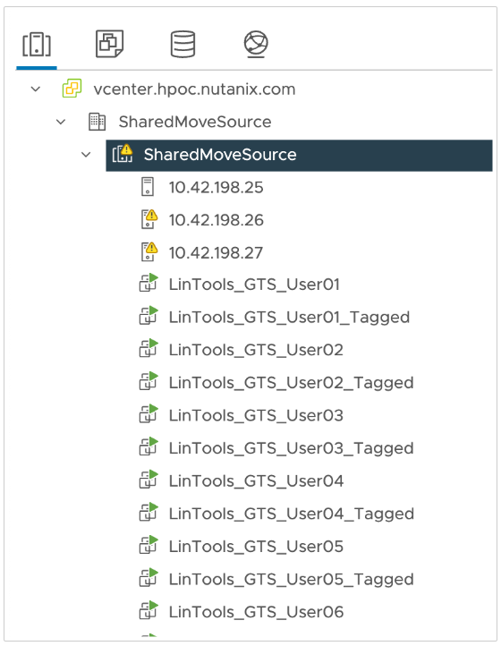

import Tabs from '@theme/TabItem';
import TabsItem from '@theme/TabItem';

Nutanix Move makes it easy to move VMs and workloads onto Nutanix with minimal downtime. 
For this portion of the lab, we'll migrate VMs from ESXi to AHV in NC2 Cluster.

## View Source VM

Let's first take a look at the source VM on ESXi that we will be migrating to Nutanix. We have 
provisioned Linux VMs for every lab user on ESXi that we will use to migrate over to Nutanix.

1. Login to the vCenter from the web browser using the IP address provided. 
**Make sure to use browser tab within your Parallels VDI instance**.

   - vCenter Address - provided by your instructor
   - username - vCenter/vServer login PHX-POC###-User##@nutanixdc.local or DM#-POC###-User##@nutanixdc.local
   - password - vCenter/vServer Password

     

     

2. From the left-hand pane, expand to the Resource Group **SharedMoveSource** and click on LinuxTools VM 
corresponding to your user number XXX_EVC_User## where XXX is represents the three digit number of your
assigned clusters. Ignore the VM ending in **_Tagged**, we'll use that later in the advanced migration

      

3. On the **Summary** page of the VM, make a note of the IP address of the VM.

       

:::note
Be sure the IP address is selected and not the host IP
:::

We will be using the IP address to connect to a code-server via a browser within the Parallels VDI desktop.
- link - http://your-XXX-VM-IP:8001

4. You will then be able to log into the code-server on that VM with the following:

- password - Cluster Lookup Sheet

:::note
All users will use the same password regardless of what other passwords you previously use
:::

You will then be able to access the terminal.

5. Let's go ahead and create a dummy file on the VM. You can close this tab once it's done.

Now that we have looked at our source VM, next let's create a migration plan to move the VM.

