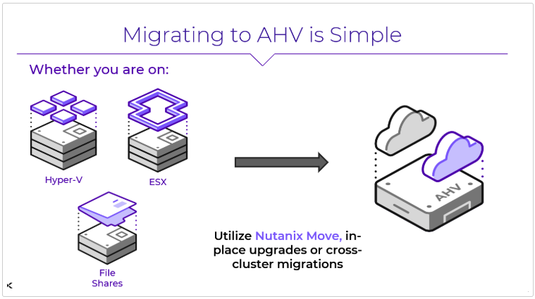
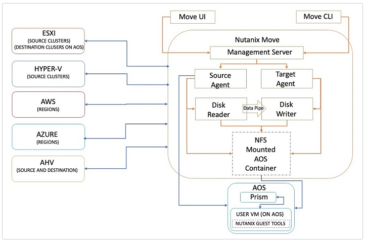

import Tabs from '@theme/TabItem';
import TabsItem from '@theme/TabItem';

## Migrating Your Workloads

There are many different types of workloads and various ways each of them can be migrated. Customers will choose the right method based on their requirements and constraints. For this lab, we'll focus on using Nutanix-based methods as they typically provide the best user experience.

## Move Architecture

Below you'll find the distributed architecture of **Move**. You can read more about the architecture and all the components on the - [https://www.nutanixbible.com/21b-vm-migration-arch.html](./installation)

Now that you have the destination cluster up and running with Prism Central and AHV, let's move some workloads.

## Key Objectives

As part of the exercise, you will:

- Setup Move source and target environments.
- Migrate VMs from ESXi to Nutanix AHV (NC2) with Nutanix Move exploring basic features. 
- Migrate VMs from ESXi to Nutanix AHV (on-prem) exploring advanced features. 
- Explore migration at scale using a click-through demo of a larger environment.

:::note

- Expected Module Duration: 30 minutes
:::
