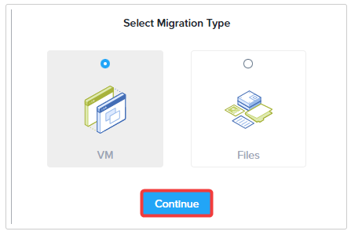

import Tabs from '@theme/TabItem';
import TabsItem from '@theme/TabItem';

## Setup Move

To migrate, we'll log in to the Move VM and setup the environments and migration plan.

1. Login to Prism Central

   - username - PC login adminuser##@ntnxlab.local or adminuser##
   - password - PC password from Connection Details

2. Navigate to Compute & Storage > VMs
   
   

3. A Move VM per user called **User##-Move** has already been created. Look for that VM 
in the main page or you can search in the search bar. Make a note of its IP address.

:::info
In the Cluster Look Up Sheet, you should see the assigned VMs against your name. There will be 10 users 
to each cluster in these labs.

example :

User01, User02, User03, User04 to User10 will map to Cluster PHX-POC196, NC2-HPOC-90vsfj

User01, User02, User03, User04 to User10 will map to Cluster PHC-POC083, NC2-HPOC-t7yi1i

and so on
:::

    

4. Open a new tab in browser within the VDI session and go to that IP address to open Move. 
If it says "Your connection is not private", click **Advanced** and then **Proceed to x.x.x.x (unsafe)**.

5. Accept the Terms and Conditions and click **Continue**. Click **Ok** on the next screen.

   

6. First, it will ask you to set a password. Set **ntnxNc2!** as the password. That way those sharing
the clusters will be able to access them as well.

   

7. Login using the same password which you have set earlier.

   

8. Click **Ok, Got It** on the splash screen.

9. Select Migration Type **VM** and click **Continue**

   

10. We need to add the Source and Destination 
Environments for Move. Let's first add the source ESXi environment. 
**Click Add Environment**

     

11. In Select Environment Type, Select **VMware ESXi**

    

:::note

As you can see, Move supports different environment types including public clouds like
AWS and Azure
:::

12. Provide the details for the environment. Click **Add**

    - Environment Name : Any Name you like. We suggest Source ESXi.
    - vCenter Server : Provide the IP address: 10.42.198.40
    - username - PHX-POC###-User##@nutanixdc.local or DM#-POC###-User##@nutnaixdc.local. 
    The username is case sensitive
    - password - vCenter password
    
    

:::note
If you get an error about user not authorized, make sure the username is correct. 
The username is case sensitive and also uses the @nutanixdc.local domain.

:::

13. Once the ESXi environment is validated and added, next lets add our 
destination Nutanix AHV cluster. Click **Add Environment**

    

14. In Select Environment Type, Select Nutanix AOS and then provide the details 
for the environment. Click **Add**. 
**Remember this is the copy of PC residing in NC2**.

    - Environment Name : Any Name you like. We suggest Target AHV.
    - Nutanix Environment : Provide the IP address of PC
    - username - PC login - adminuser##@ntnxlab.local
   password - PC password

      

15. Now repeat **steps 13 to 14** to add in NC2 environment as another destination. 

16. Now is a good time to pause for a minute while the Prism Central is added 
to the Move instance and it retrieves the inventory.

17. After a short pause you can proceed to the basic migration in **"Migrating 
VMs with Move"** with the link below.
