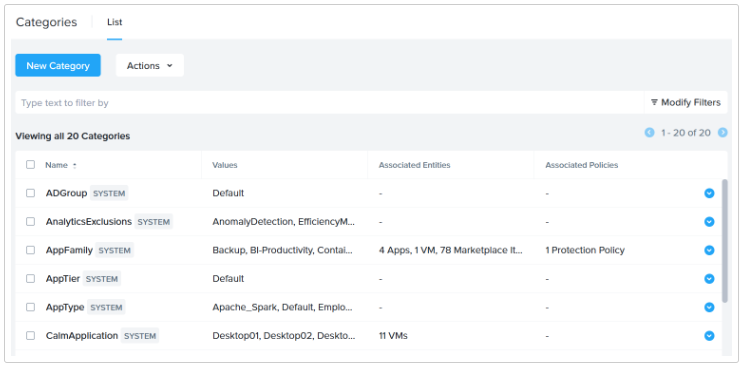
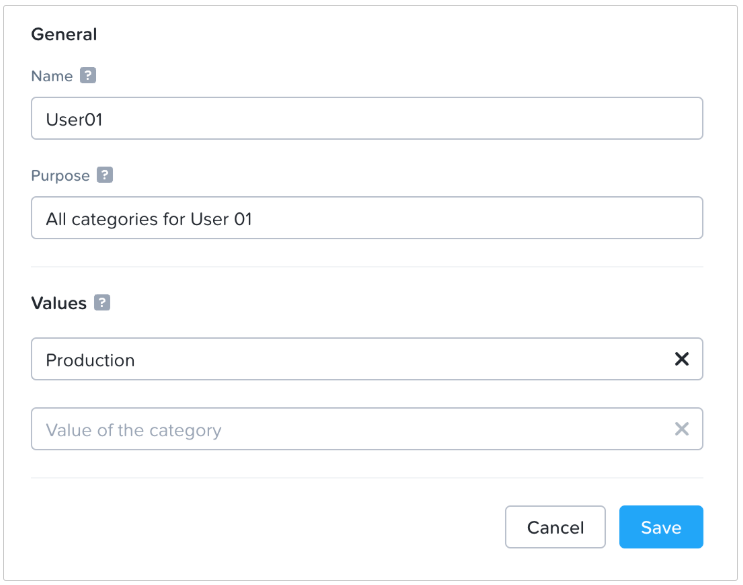
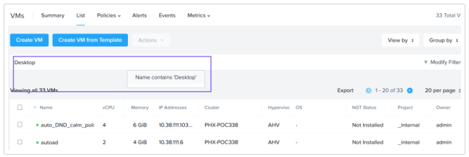
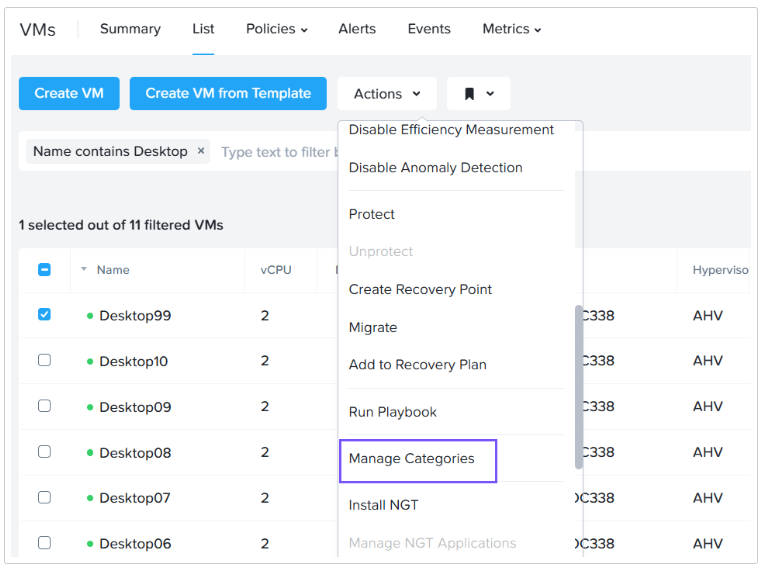
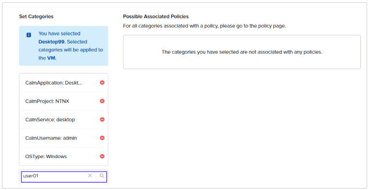
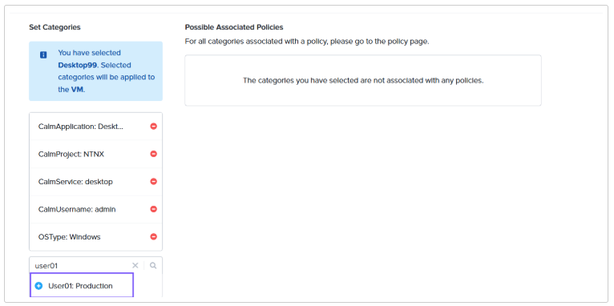
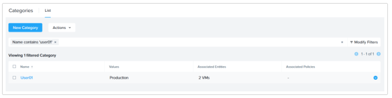
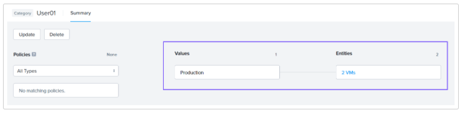
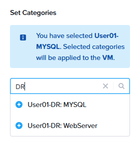

import Tabs from '@theme/TabItem';
import TabsItem from '@theme/TabItem';

## Create a Category
1. Login to Prism Central using **adminuser##**.
2. Expand **Administration** from the Infrastructure Dashboard.
3. Click **Categories**.
4. Prism Central has 20 predefined system categories that cannot be updated or deleted. You can assign entities to these system categories while creating or updating VMs and other entities.

   

5. Click **New Category**.

6. Define the category parameters.
   - Name: Provide a name for the category. You can name it **User##** where **##** is your assigned **User #**. In this example we have named it **User01**

   - Purpose: Give your category a purpose.
   
   - Values: **Production**

   - Click **Save**
   
     

7. Let's go ahead and assign this category to the VMs Desktop **##** , and User **##**-Move   

8. Expand **Compute & Storage**. Click on **VMs**.

9. Search for the VMs Desktop **##** where **##** is your assigned number

     

10. Select the Desktop **##** VM. Click Actions. Select **Manage Categories**.

     

11. Search for the category which you had created. In our example it is User01:Production

     
    
12. Add the category by clicking the + sign next to User##:Production

     

13. Click Save when you have added the category.

14. Let's add the other VM User **##**-Move to the category User **##**:Production by following the steps from 9 to 13.

Next, we'll navigate to the Categories section to see the categories and entities relationship

1. Expand Administration from the Infrastructure Dashboard.

2. Click **Categories**

3. Search for Category User **##** where **##** is your assigned User **#** from Connection Details.

4. Click User **##**.

   

5. You'll notice that the category has 2 VM as its associated enitites.

   

## Create Additional Category for DR 

:::info
These additional categories are meant for the DR labs in this session.
:::

1. Repeat **steps 5 - 6**.

   Define the category parameters.

   -  Name: Provide a name for the category. You can name it **User##-DR** where **##** is your 
   assigned User #. In this example we have named it **User01-DR**, **User02-DR**, **User03-DR**

   -  Purpose: Give your category a purpose. e.g DR to NC2

   -  Values: **MYSQL**,
              **WebServer**

   -  Click **Save**

2. Add your assigned VMs to the category.
   
   - **UserXX-MYSQL** - **UserXX-DR: MYSQL**
   - **UserXX-Webserver** - **UserXX-DR: WebServer**

   

   
