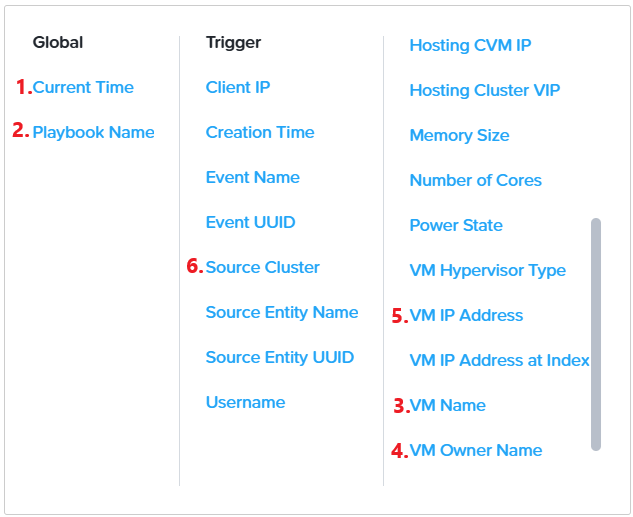

import Tabs from '@theme/TabItem';
import TabsItem from '@theme/TabItem';

## Overview

**X-Play** is a user-friendly automation tool designed to streamline routine administrative tasks and automatically resolve issues that arise within your system. This automation is achieved by creating Playbooks.

A **Playbook** consists of a trigger and a set of actions that execute when the trigger is activated.

The trigger can be based on a specific alert or a group of alerts, events like VM creation or deletion, manual initiation to run a series of tasks with a single click, scheduled to run at a specific time (similar to cron jobs), or triggered through a webhook via a REST API call from a third-party tool.

The action gallery contains 45 native actions that can be chained together, including integrations with tools like PagerDuty, ServiceNow, Slack, Microsoft Teams, and more. If a native action is not available, you can use REST APIs and scripting actions to create custom workflows.

## Create a Playbook

An IT Admin wants to receive an email notification whenever a VM is created in the Environment. For example, when VMs are migrated from ESXi to AHV. Let’s explore how Playbooks can automate this process. We'll use a simple trigger and then a branch condition to filter down the list of VMs.

1. Login to Prism Central using **adminuser##** and the PC password from the Connection Details page.

2. Navigate to the App Switcher section in the top left of Prism Central. Click **Intelligent Operations** in the App Switcher.

3. Select **Playbooks** from the Intelligent Operations Dashboard.

4. Click **Get Started**.

5. Click **Create Playbook**.

   

6. We can view a list of available triggers, including Alerts, Events, Time-based, Manual, and Webhook triggers. For this example, let's choose the event-based trigger, as we are focusing on a VM creation event.

   

7. Search for Created VM event in the **Select an Event Type** field.

   

8. In the Target VM, choose **All Applicable VMs**.

   

9. Click **Add Action**.

   

10. We can view a list of available actions. Select the **Branch** action.

    

11. Define the following Values for the branch condition:
    
    Condition: **If**

    Operand: Click **Parameters** and select **Event: Source Entity Name**

    Operator: **regexp**

    Value: User **##** where **##** is your assigned **User #** from Connection Details. In this example, we are using User01.

    

12. We are going to add a second action within this branch. Click **Add Action** within the Branch Condition.

     

13. Select ""Lookup VM Details"" because the IT Admin would like to receive information about the newly created VM.

     

14. In the **Target VM** field, Leave it as **Event: Source Entity**
     

15. We are going to add a third action. Click **Add Action** within the Branch Condition

     

16. Select Email Action.

17. Enter your own Email Address in the Recipient Field. 

    :::note
    Since the SMTP is not set to your company default mail server, you are likely to get an error. This is intentional, so as not to skip this step, so that you will learn that this is a functionality is possible in any environment with a proper SMTP server.
    :::

18. Enter "Your virtual machine is created" in the **Subject** field.

19. In the Message Field, Click **Parameters**. Ensure the below parameters are selected:

    Type in **Playbook Run Time**: and select the Parameter **Playbook: Current Time**

    Type in **Playbook Name**: and select the Parameter **Playbook: Playbook Name**

    Type in **VM Name**: and select the Parameter **Lookup VM Details: VM Name**

    Type in **VM Owner**: and select the Parameter **Lookup VM Details: VM Owner Name**

    Type in **VM IP Address**: and select the Parameter **Lookup VM Details: VM IP Address**

    Type in **Source Cluster**: and select the Parameter **Event: Source Cluster**

    

20. Click **Save & Close**.

21. Provide a unique name for the Playbook. Let's call it **"User## VM Created"** where **##** is your assigned number

22. Lets enable the Playbook by toggling the status to Enabled.

    

23. CLick **Save**.

24. You'll see this playbook in action as you migrate your VMs.

:::note

You might see your playbook executed partially successfull. It is okay and is intentional due to the lab environment.
:::
 