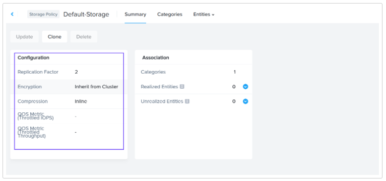
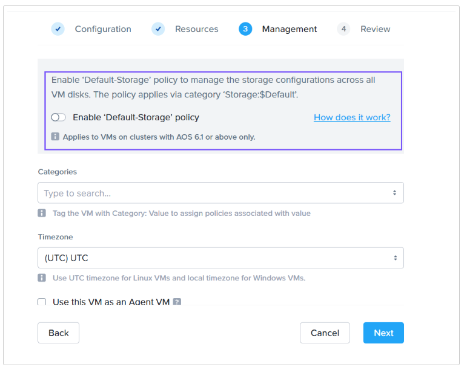
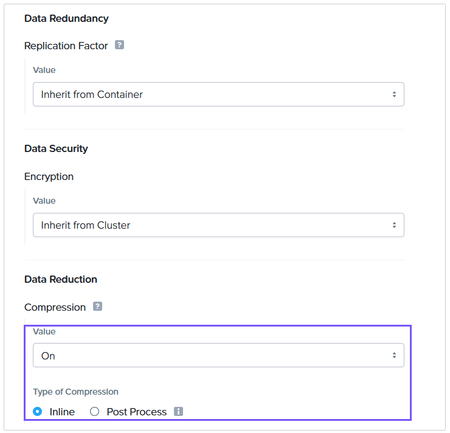
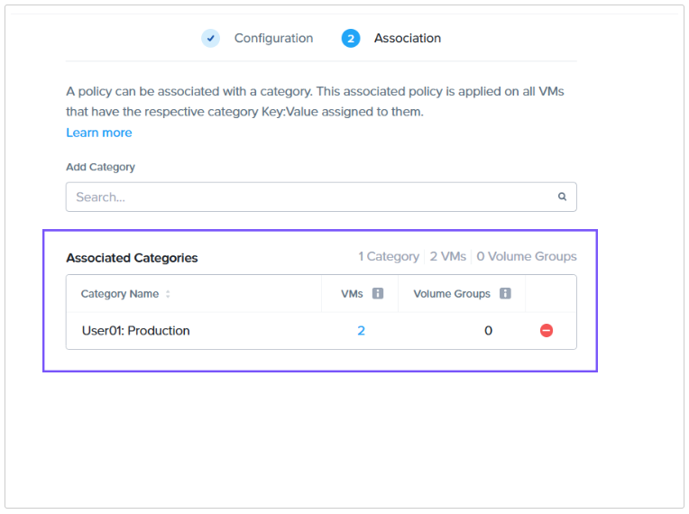

import Tabs from '@theme/TabItem';
import TabsItem from '@theme/TabItem';

## Overview of Policies

Policies are used to define the systematic configuration guidelines for entities such as VMs, Images, Storage, and Network Security.

Nutanix Prism Central enables you to create and manage the following policies

- VM Management - Allows you to manage policies related to VM-Host Affinity, VM-VM Anti-Affinity and NGT Policies

- Image Management - Allows you to manage policies related to Image Placement and Bandwidth Throttling.

- Storage Policies - Allows you to manage policies related to storage attributes like Replication Factor, encryption, compression and QoS of VMs and Volume Groups entities.

- Security Policies - Allows you to manage policies related to VM network traffic.

- Protection Policies - Allows you to manage policies related to Disaster Recovery attributes such as asynchronous, synchronous, and near sync replication.

In this section, you will learn how to create a storage policy.

### Storage Policy

## Default Storage Policy

Prism Central 2024.1 or later version has a predefined or default Storage Policy. The default storage policy has the below parameters

- Replication Factor is set to 2
- Encryption is set to Inherit from Cluster
- Compression is set to Inline
- No values are set for QoS

  

The default storage policy cannot be updated or deleted. However, it can be cloned to make changes.

Entities such as VMs and Volume Groups can be added to the Default Storage Policy by enabling the "Enable Default-Storage Policy" switch when you create or update a VM or Volume Group.

  

## Create a Custom Storage Policy

1. Login to Prism Central using **adminuser##** and the PC password from the Connection Details page.

2. Expand **Compute & Storage** in the Infrastructure Dashboard.

3. Click **Storage Policies**.

4. Click **Create Storage Policy**.

5. Provide a name for the Storage Policy. Let's call it user **##**-sp where **##** is your assigned **User #** from Connection Details.

6. Let's set the **Replication Factor** to **Inherit from Container**.

7. Set **Encryption** to **Inherit from Cluster**.

8. Turn on **Compression** and use **Inline Compression**.

   

9. Click **Next**.

10. Let's define the VMs belonging to User **##**:Production Category where **##** is your User **#**. In this example, it is User01:Production

    

11. Click **Save**.

12. You should see your policy listed in **Storage Policies**.

### Categories and Policies Takeaways

You'll see these categories and policies used later in the lab. Let's move on to setting up some no-code automation to get ready for our onboarded workloads.